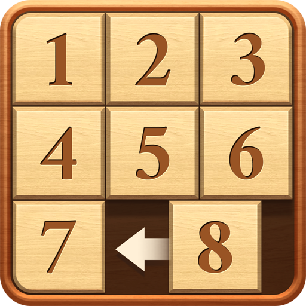

## Homework Requirements

- A 3x3 board, with 8 textures, and a wooden border,
- User should be able to run the application by double-clicking on the .exe file,
- User should be able to pass the initial positions of the cells when running the application from command line,

For example, running the following command (powershell)

```
output-dir> .\Homework.Puzzle.SlidingNumber.exe 3 2 1 6 5 4 8 7 # The last cell is always empty
```

Should start the game with this board

```
3 2 1
6 5 4
8 7 
```

args can be read in `main`[^1] function like this

```
int main(int argc, char* argv[])
{
   // You can get the input from `argv`
}
```

- Don't start the game if the arguments are invalid,
- User should be notified when he/she wins (ex. show a "You win" texture floating over the board),
- There should be a **start again** button (always enabled, even when the game ends).

## Groups (23, 15, 7)[^2] / Thursday 12/7/2023

- User should be able to move pieces using WASD keys,

## Groups (24, 16, 8)[^3] / Thursday 12/14/2023

- User should be able to move a piece by mouse-clicking over it,
- When some piece is moved, a pop up sound should be played.

---

Notes[^4]:

- You **must** Implement the game in [Homework.Puzzle.SlidingNumber](./) project (legacy OpengGL API is allowed),
- Each student **must** attend the lab with the group he/she belongs to,
- **4th/5th-year students** are free to attend with any group, but **must** deliver the same homework given to that group,
- Source code should be submitted one day before the interviews (a link will be provided in the discussion),



[^1]: In visual studio, you can debug the application with default args, project Properties -> Debugging -> Command Arguments, set the default args there (for example. `3 2 1 6 5 4 8 7`)
[^2]: 75 minutes for each group, starting at 9:00 AM
[^3]: 75 minutes for each group, starting at 9:00 AM
[^4]: More instructions comming out throught this week