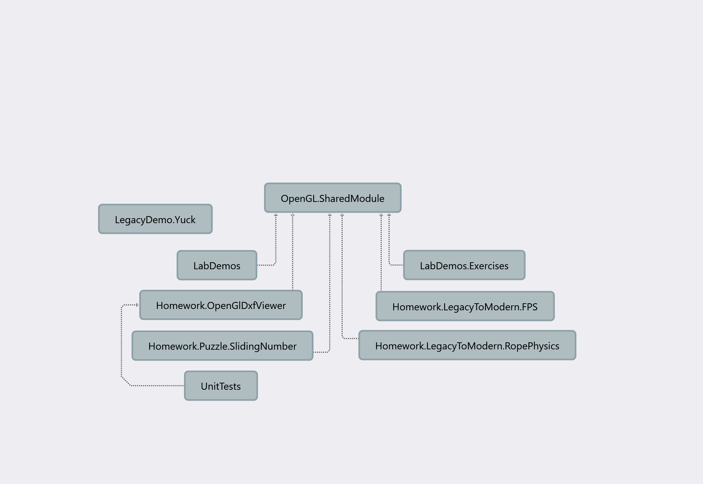

## Projects

Each project has `README.md` file, here is a brief description about them:

- [LabDemos](./LabDemos) application: shows a list of demos, you can choose to run a demo by entering its number.
- [LabDemos.Exercises](./LabDemos.Exercises) application: similar to LabDemos, but the implementation is left to you as exercise :smile:, 
    - This will help you getting handy with the tech.
- [OpenGL.SharedModule](./OpenGL.SharedModule) Library: 
    1. Contains shared code .c and .cpp files (ex. glad.c, stb_image.cpp, imgui*.cpp, etc...)
    2. Also, I've put global dependencies' artifacts (i.e. .h, .dll, .lib) in this library
    3. This library does depends on nothing, but all other apps (ex. `LabDemos`, `LabDemos.Exercises` and Homework.*) depends on it, except for:
- [LegacyDemo.Yuck](./LegacyDemo.Yuck) application: A showcase of legacy opengl app
    - Dependencies of this application are bundled within it, *Not within OpenGL.SharedModule*. So this project does not depend on any other project
    - It shows that modern/legacy projects can be found in the same solution!
- [Homework.*](./): details for each homework can be found in README.md file in homework's root folder
    - Homerowk(s) will be announced in [Discussions](https://github.com/MuhammadSulaiman001/opengl-lab/discussions)
    - To watch all activities on this repo, select "All Activity" in Watch dropdown in the repo.
    - **Don't create pull requests for your solutions to exercises and homeworks**
    - **Moreover, Don't fork this repo and push your code to your public repo!**
    - **For Homeworks: User should be able to run the application by double-clicking on .exe**
- [UnitTests](./UnitTests): Unit Tests everywhere[^1] :100:

NOTEs: 
- To make changes to the code (ex. for do exercises and homeworks), I recommend you create new local branchand keep the master branch clean (to avoid code conflicts when pulling changes from remote).
- Modules (.ixx) used in LabDemos*, Headers (.h) used in Homework.* Projects
	- Modules let you free to rename parent folders, move .ixx file to another folder

[^1]: In general, you should create unit test project(s) wherever you work on a [modular] application.
