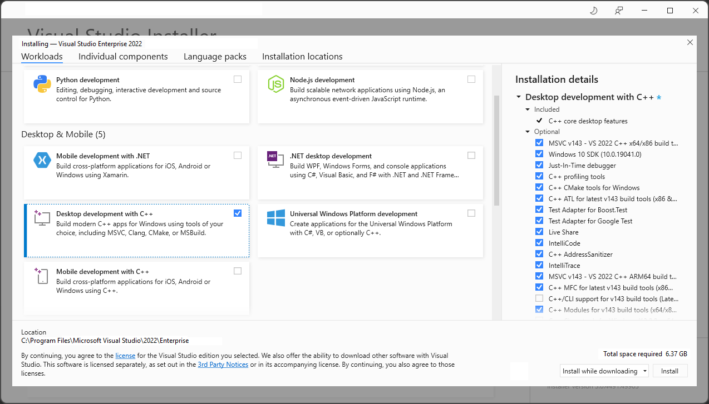

## Quick Start

### Tech Setup[^1]

We'll use the most-up-to-date tools to build/develop C++ projects:

1. Install/Update [Visual studio 2022 - Community Edition](https://visualstudio.microsoft.com/downloads/)



2. Install/Update CMake [(official site)](https://cmake.org/download/) (use the `.msi`)
3. Install/Update Git [(official site)](https://git-scm.com/downloads)
4. Install/Update Powershell [(Microsoft Store)](https://apps.microsoft.com/store/detail/powershell/9MZ1SNWT0N5D)
    - Needs VPN (in some countries :thinking:)
    - Or from [GitHub repo](https://github.com/PowerShell/PowerShell/releases)
5. Add `cmake` and `git` to PATH environmental variable (at top of the list), these are the default paths
    * `C:\Program Files\CMake\bin`
    * `C:\Program Files\Git\bin`
6. Add `msbuild` to PATH,
    - To find `msbuild.exe`: Open Visual Studio 2022 -> Tools menu -> Command Line -> Developer Command Prompt -> Run `where msbuild` -> copy the path[^2] and add it to PATH
    - This allows you to build any `.sln` from command-line (ex. powershell), so you don't have to open the solution (.sln) in VS in order to build the projects (especially if you do clone opensource projects alot :smile:)

### Build projects in this repo

Run the following commands in Powershell (one by one)

```
cd ~\desktop # go to desktop
mkdir opensource && cd opensource
git clone https://github.com/MuhammadSulaiman001/opengl-lab
cd opengl-lab\OpenGLab # move to .sln location
msbuild OpenGLab.sln # build the solution
```

Now, you can find the build output for inside project folder (ex. `LabDemos.exe` can be found in `LabDemos\x64\Debug\` folder)

### Build projects in [LearnOpenGL](https://github.com/JoeyDeVries/LearnOpenGL) repo

```
cmake --version # verify cmake is installed
git --version # verify git is installed
cd ~\desktop\opensource
mkdir opensource && cd opensource
git clone https://github.com/JoeyDeVries/LearnOpenGL
cd LearnOpenGL
mkdir build && cd build # create/move to build directory
cmake .. # build the build system :)
# cmake --build . # build all the projects, might take few minutes!
# cmake --build . --target 1.getting_started__2.1.hello_triangle # builds only this target
cd ..\bin # move to output location
explorer . # open in windows explorer!
# now, you can check project's output, run .exe files
```

You can find .exe files in projects folders..

Great, you have built/run many opengl projects, without writing any C++ code (or opening visual studio at all).

## Next:

1. [Get familiar with the build system and the IDE](https://learn.microsoft.com/en-us/cpp/build/projects-and-build-systems-cpp?view=msvc-170)
2. [Learn C++](https://learn.microsoft.com/en-us/cpp/cpp/?view=msvc-170)
2. [Learn OpenGL](https://learnopengl.com/Introduction)
3. Learn the basics of Git, Poweshell 7.x.x and CMake
    - [Getting started with git](https://git-scm.com/book/en/v2)
        - [Cheatsheet](https://training.github.com/downloads/github-git-cheat-sheet/)
        - [Atlassian tutorial](https://www.atlassian.com/git/tutorials/)
    - [Getting started with Powershell](https://learn.microsoft.com/en-us/powershell/scripting/learn/ps101/01-getting-started?view=powershell-7.3)
    - [Getting started with CMake](https://cmake.org/cmake/help/latest/guide/tutorial/A%20Basic%20Starting%20Point.html)


[^1]: Please note that the following configuration is not opengl-specific!
[^2]: There might be 2 paths, one for visual studio and one for .NetFramework, choose the visual studio one.