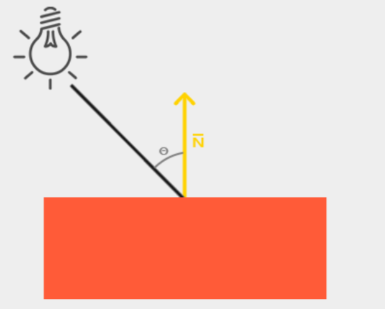
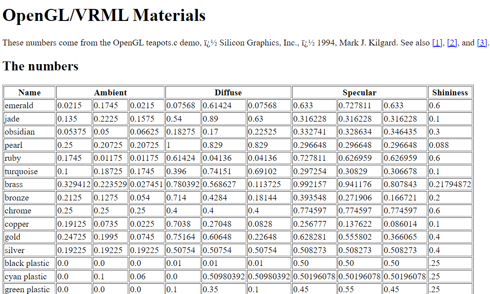

## Lectures' Reference
- Articles on [learnopengl.com](https://www.learnopengl.com) are the main reference for this Lab.
    - **Mainly:** Getting started, Lightining, Model Loading, Depth Testing and Blending.
    - Complementary: the remaining topics!

## Lecture Notes (WIP[^1])

- Windows Coordinates System (2D)
    - (0,0) at top-left of the window
    - x-axes direction goes towards top-right corner
    - y-axes direction goes towards bottom-left corner
- OpenGL Coordinates System (3D)
    - (0,0,0) at the center of the scene
    - x-axes direction goes towards top-right corner
    - y-axes direction goes towards top corner
    - z-axes direction goes towards YOU :punch:
- Texture Coordinates System (2D)
    - (0,0) at the bottom-left of the texture
    - x-axes direction goes towards bottom-right corner
    - y-axes direction goes towards top-left corner

- Shader code will be applied over each point of your data.
    - GLSL = shader's programming language (similar to C-language)
    - shaders run on GPU side

- VBO, VAO: 
    - one benefit is that, putting the data near the GPU makes rendering faster
    - ...

- Homogeneous coordinate = the w component of a vec4 (position).

- Think of the scene as the following:
    - it starts where all the objects are in 0,0,0
    - objects will scatter away because you 1. multiply each object with model matrix 2. draw it,
    - after this, the scene is ready, but you can change the perspective (the eye position of the user), by multiplying all objects in the scene by view matrix
    - to give the user the impression/illusion that the scene is 3D, all the objects will be multiplied by projection matrix, which will: 1. scale x,y values down if z value is small, scale x,y values up if z value is large

- **[Primitives](https://www.khronos.org/opengl/wiki/Primitive)** 
    - Some premetives are deprecated in core profile (ex. GL_QUADS), so nothing will be drawn on the screen if you use such premetives,
    - Take a look at the picture below, and keep an eye on the directions and numbers of the vertices, here are a couple of notes:
    - GL_LINE_STRIP vs. GL_LINE_LOOP 
        - after the second point, a new line connecting the new point with the previous one,
        - the difference is that, GL_LINE_STRIP will stop at the last point, whereas GL_LINE_LOOP will add extra line between the last point and the first one
    - GL_TRIANGLES vs. GL_TRIANGLE_STRIP
        - the former reads first 3 points to form a triangle, then read the next 3 points to form another triangle
        - the later reads first 3 points to form a triangle, then reads one point at a time, a new triangle will be creating using the new point with the 2 points before it.
    - GL_TRIANGL_FAN
        - reads 3 points to create a triangle, then for every new point, a new triangle is created using the point, the previous point and the first point
    - See Premitives exercise in `LabDemos.Exercises` project

- The glClearColor function is a state-setting function and glClear is a state-using function

- main app can pass values to both vertex and fragment shaders
    - also, vertex shader can pass values to fragment shader

[^1]: Work in progress.. not always in good shape :kissing_smiling_eyes:

## Lighting

- Ambient
	- objects are almost never completely dark
	- ex. moon light

- Diffuse
	- The color of the fragment based on the position of the light
    - diffuse and ambient should be the same (often)

If the angle gets smaller, the shape should get lighter,
If the angle gets larger, the shape should get darker..

- Specular 
	- Simulates the bright spot of a light that appears on shiny objects
	- The color of the fragment based on the position of the viewer

When the Phong lighting model is implemented in the vertex shader it is called Gouraud shading instead of Phong shading

To determine the color of the shape, fragment shader needs the normal vector (yellow) and the lamp position... we pass these values so the final color is calculated like this

The specular component of the light is usually kept at vec3(1.0) shining at full intensity.

To use values from this [table of materials](http://devernay.free.fr/cours/opengl/materials.html): give light properties full intensities

- Lighting maps
	- Objects in the real world however usually do not consist of a single material!

