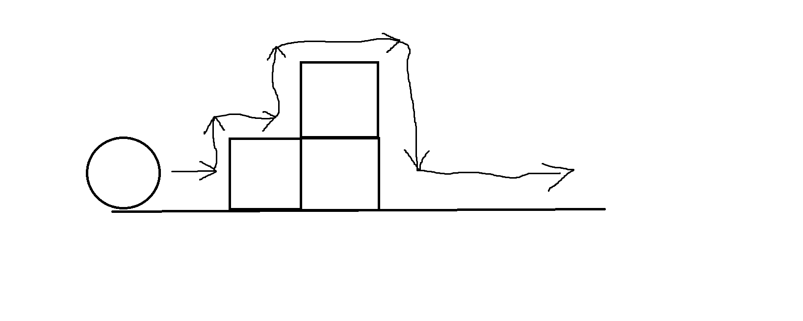

# Walking-circle (8 marks)

## Game description

When running the application, there should be a scene **99% similar to this**:

- Bind the circle with awesomeface.png, and the box with container.jpg
- There are 3 boxes only, positioned like the image above.

- Use these textures specifically:
    - [awesomeface.png](https://learnopengl.com/img/textures/awesomeface.png)
    - [container.jpg](https://learnopengl.com/img/textures/container.jpg)

## When user presses arrows' keys on keyboard

1. right arrow: moves the ball to the right
2. left arrow: moves the ball to the left
3. up arrow: moves the ball up
4. down arrow: moves the ball down

- When nothing is pressed, the ball stays in its position.
- User can move the circle backward to get back to the starting position, not beyond.
- Intersections between objects is not allowed, i.e. they can not cross each other.
- Boxes' positions are fixed and should not move at all.
- Please, don't add any requirement by yourself, there is no gravity! no jump (e.g. space key)

## When the game end?

- The game ends when the ball moves beyond the scene (positive X-axis) and disappears completely (not partially).

1. Don't draw anything on the screen, not even on the console.
2. User can't restart the game.
3. User can only close the application

---

# Bonus (2 marks)

Compile/Run one of the following demos on your machine:
1. [Legacy sample](https://github.com/gamedev-net/nehe-opengl/tree/master/vc/Lesson21)
2. [Modern sample](https://github.com/JoeyDeVries/LearnOpenGL/tree/master/src/2.lighting/6.multiple_lights)