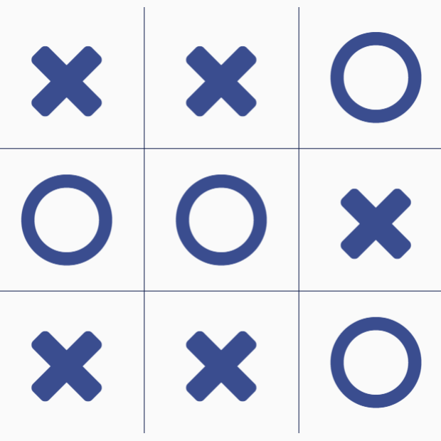

# Tic-tac-toe (8 marks)



## Game description

* When running the application, there should be an empty 3x3 board, user can press any number from 1-9, "X" starts the game.

* This is how we will map keys to cells

```
[7 8 9]
[4 5 6]
[1 2 3]
```
- You can use "X", "O" textures of your own choice.


### When user presses on a number in [1,9] range:

1. If the cell is free, you should add a texture to fill that cell.
2. If the cell is occupied, nothing will happen.


### When the game ends (win-loose or draw):

1. Don't draw anything on the screen, not even on the console
2. User can't restart the game.
3. User can only close the application.

---

# Bonus (2 marks)

Compile/Run one of the following demos on your machine:
1. [Legacy sample](https://github.com/gamedev-net/nehe-opengl/tree/master/vc/Lesson12)
2. [Modern sample](https://github.com/JoeyDeVries/LearnOpenGL/tree/master/src/1.getting_started/7.4.camera_class)