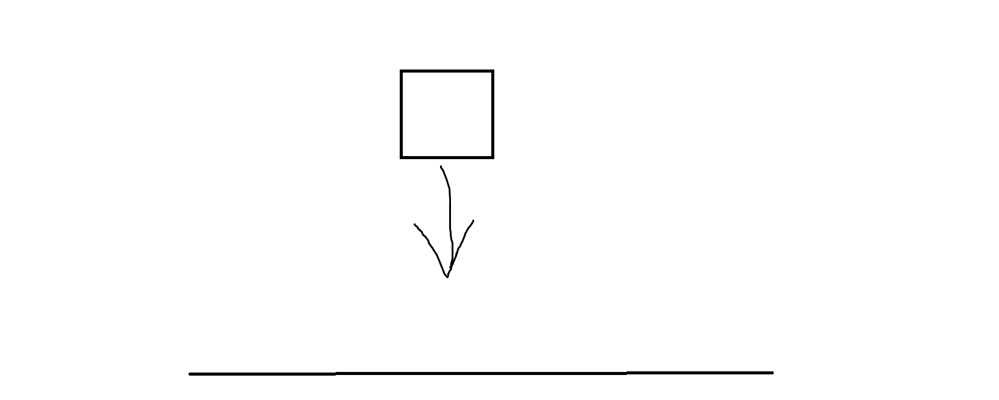
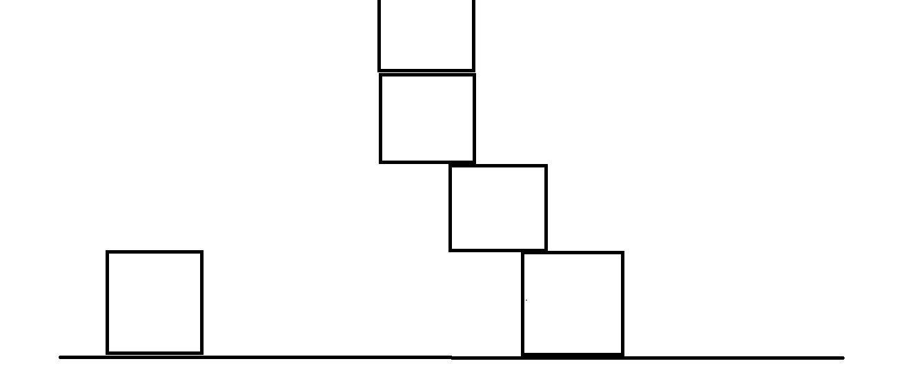

# Fallen-boxes (8 marks)

## Game description

* When running the application, there should be an empty scene, and immediately, one box starts falling down to the ground.

* User can use left/right arrows on the keyboard to move the box while the box is moving down.

* Once the box is stable, a second box will start to fall.

Use [container.jpg](https://learnopengl.com/img/textures/container.jpg) as a texture for the box.

- The width of the scene should fit 4-5 boxes next to each other.
- The height of the scene should fit 7-8 boxes on top of each other.
- You should be able to control the box dimension from the code (one global variable for the dimension of each box).
- You should be able to contol the speed of the fall from the code.
- Boxes should not intersect (i.e. not allowed to cross each other).
- User can only use left/right arrows
- User can not prevent the box movement.

### When the game ends?

Game ends when boxes cross the top of the screen (the top of the top-most box might not be visible).

1. don't draw anything on the screen, not even on the console
2. user can't restart the game.
3. user can only close the application

---

# Bonus (2 marks)

Compile/Run one of the following demos on your machine:
1. [Legacy sample](https://github.com/gamedev-net/nehe-opengl/tree/master/vc/Lesson33)
2. [Modern sample](https://github.com/JoeyDeVries/LearnOpenGL/tree/master/src/4.advanced_opengl/1.1.depth_testing)